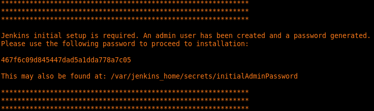

# quick-jenkins
Quickly get a local jenkins docker container going for testing.

# Getting started
- Run the following commands:
  - `docker-compose up`
  - Check the output for text that looks like the following:
  
